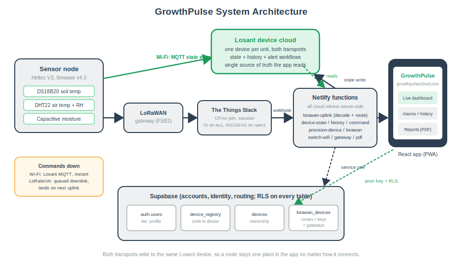
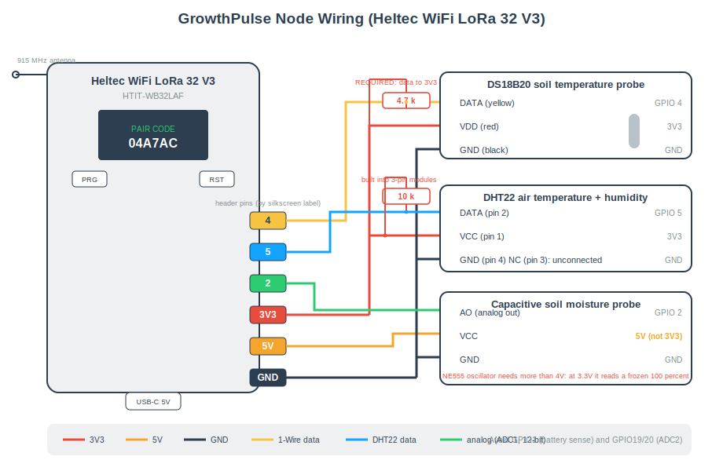
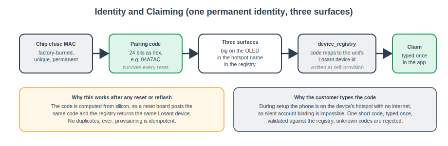
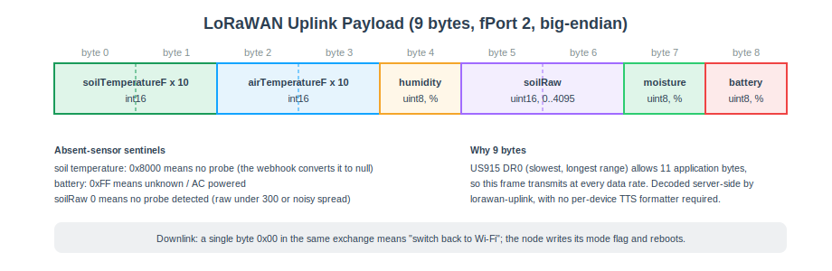
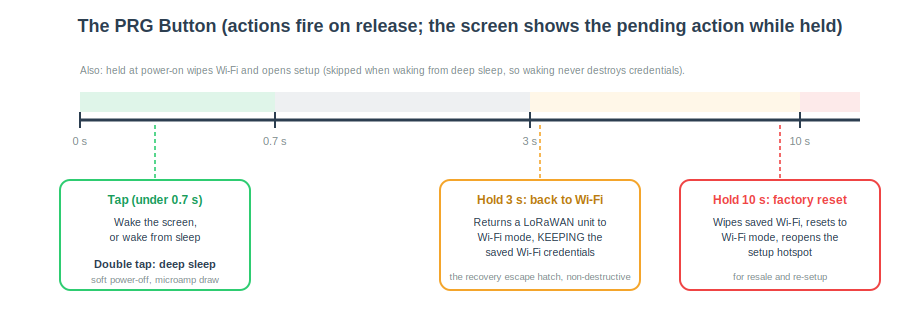
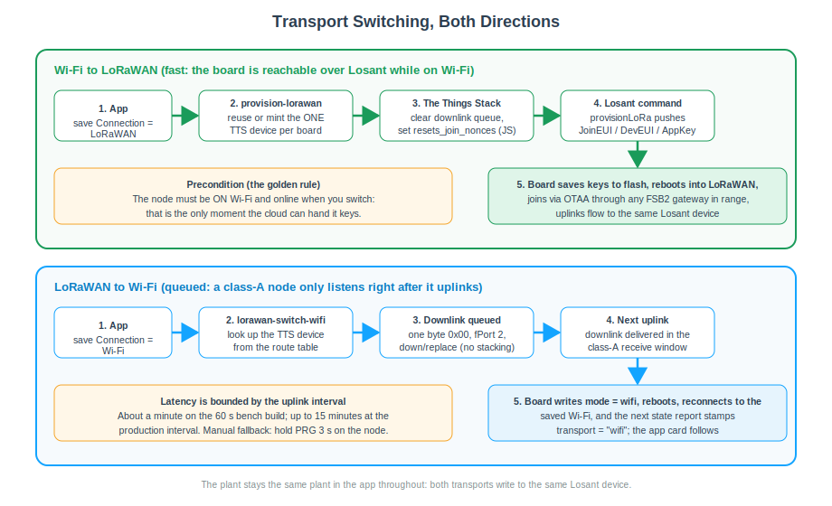

# GrowthPulse Technical Reference Manual

| | |
|---|---|
| Document | GP-TR-001, GrowthPulse Technical Reference Manual |
| Revision | 1.0 |
| Date | June 11, 2026 |
| Status | Released |
| Classification | Internal, confidential |
| Applies to | Firmware v4.3, Web app v2.22.2 |

## About this manual

This is the current-state specification of GrowthPulse: every pin, constant, identifier, payload, endpoint, schema, and configuration value in the shipping system, in reference form. It states what the system is; the Engineering Manual explains why it is that way, and the Operations Manual explains how to work on it. The source code is authoritative; if this document and the code disagree, correct this document.

---

# 1. System versions and identifiers

| Item | Value |
|------|-------|
| Production firmware | GP_Combined v4.3 |
| Web application | v2.22.2 |
| Live application URL | https://growthpulsecloud.com |
| Source repository | github.com/BryanPuckettGH/growthpulse-app |
| Losant application device class | standalone, one device per physical unit |
| TTS application id | growthpulse |
| TTS deployment | The Things Stack Sandbox (The Things Network) |
| LoRaWAN region | US915, sub-band 2 (FSB2) |
| Demo unit pairing code / hotspot | 4A7AC / GrowthPulse-04A7AC |
| Demo unit Losant device id | 6a1fb486df527c8bf8d3324b |
| Development gateway | Elecrow ThinkNode G1, EUI E4:38:19:FF:FE:2A:58:80 |



---

# 2. Hardware reference

## 2.1 Board

Heltec WiFi LoRa 32 V3 (silkscreen HTIT-WB32LAF): ESP32-S3 dual-core at 240 MHz, 8 MB flash, 2.4 GHz Wi-Fi b/g/n, BLE, Semtech SX1262 sub-GHz radio, 0.96 inch SSD1306 128x64 OLED on I2C, USB-C through a CP2102 UART bridge, RST and PRG buttons, JST LiPo connector with onboard charge circuit, onboard 3.3V regulator.

## 2.2 Complete GPIO map

| GPIO | Function | Direction | Notes |
|------|----------|-----------|-------|
| 0 | PRG button | input, pull-up | Boot-strap pin; safe to read after boot; deep-sleep wake source |
| 1 | Battery sense ADC | analog in | Midpoint of the battery divider; never use for sensors |
| 2 | Soil moisture AO | analog in (ADC1) | 12-bit reads, 0 to 4095 |
| 4 | DS18B20 data | 1-Wire | Requires external 4.7k pull-up to 3V3 |
| 5 | DHT22 data | digital | Requires 10k pull-up to 3V3 (built into 3-pin modules) |
| 7 | Optional VBUS sense | analog in | Midpoint of optional 100k/100k divider from the 5V pin; read only when USE_VBUS_SENSE = 1 |
| 8 / 9 / 10 / 11 | SX1262 NSS / SCK / MOSI / MISO | SPI | Fixed by board routing |
| 12 / 13 / 14 | SX1262 RST / BUSY / DIO1 | control | Fixed by board routing |
| 17 / 18 / 21 | OLED SDA / SCL / RST | I2C | Fixed by board routing |
| 36 | Vext (OLED power rail) | output | Drive LOW to power the OLED |
| 37 | Battery sense control | output | Gates the battery divider; polarity inverted from the Heltec reference on this board |

Constraints: analog inputs must be ADC1 channels (GPIO1 to 10); ADC2 (including GPIO19 and 20) is owned by Wi-Fi while the radio runs. ADC resolution is configured to 12 bits.

## 2.3 Sensor wiring specification



| Sensor | VCC | GND | Signal | Pull-up | Failure signature |
|--------|-----|-----|--------|---------|-------------------|
| DS18B20 (soil temperature) | 3V3 | GND | GPIO4 | 4.7k to 3V3, required | -127 C / -196.6 F sentinel |
| DHT22 (air temp + humidity) | 3V3 | GND | GPIO5 | 10k to 3V3 (built into 3-pin modules) | NaN, serialized as null |
| Capacitive soil moisture | **5V** | GND | GPIO2 | none | raw < 300, or 10-sample spread > 600 |

The soil probe is powered at 5V because its NE555 oscillator requires more than about 4V; its analog output stays below about 3V, inside the ADC's safe range. DS18B20 addresses begin with family code 0x28.

## 2.4 Power specification

| Item | Value |
|------|-------|
| Input | 5V via USB-C, or 5.0V at ~1A limit into the 5V/GND header pins |
| Draw | ~150 mA idle; 300 to 500 mA bursts during Wi-Fi transmit |
| Sensors | Single-digit mA, from the board's regulated rails |
| Battery | LiPo on the JST connector; charged by the onboard circuit over USB-C |
| Battery voltage range | 3.04V (0 percent) to 4.26V (100 percent), 100-entry discharge curve |
| Battery ADC conversion | volts = 16-sample raw average / 238.7 |
| Charging detection | Inferred: rising smoothed voltage, or at/above 4.18V; pinned at/above 4.22V and flat reports AC |
| Deep sleep draw | Microamps (OLED rail off, wake on PRG) |

---

# 3. Firmware reference (GP_Combined v4.3)

## 3.1 Build configuration

| Setting | Value |
|---------|-------|
| Board | "Heltec WiFi LoRa 32(V3)" (Espressif esp32 core; boards index espressif.github.io/arduino-esp32/package_esp32_index.json) |
| Partition scheme | Larger-app / "Huge App" (the combined image overflows the default slot) |
| Upload speed | 921600 default; drop to 115200 for marginal cables |
| Serial monitor | 115200 baud |
| USB driver | Silicon Labs CP210x VCP |

## 3.2 Libraries

| Library | Author | Used for |
|---------|--------|----------|
| WiFiManager | tzapu | Captive-portal Wi-Fi provisioning (2.0.17 at time of writing) |
| OneWire | Paul Stoffregen | 1-Wire bus for the DS18B20 |
| DallasTemperature | Miles Burton | DS18B20 conversion |
| DHT sensor library | Adafruit | DHT22 (installs Adafruit Unified Sensor) |
| Losant Arduino MQTT Client | Losant | Device cloud connection (installs PubSubClient) |
| ArduinoJson | Benoit Blanchon | Telemetry and command payloads |
| U8g2 | oliver | OLED |
| RadioLib | jgromes | SX1262 LoRaWAN class-A stack |

## 3.3 Key constants

| Constant | Value | Meaning |
|----------|-------|---------|
| FW_VERSION | "4.3" | Shown on the self-test and pairing screens |
| LORA_SUBBAND | 2 | US915 FSB2; must match gateway and TTS |
| UPLINK_FPORT | 2 | LoRaWAN uplink port; downlinks are read from the same exchange |
| LORA_UPLINK_MS | 60 s | Bench/demo value; raise toward 15 min for production fair-use |
| WDT_TIMEOUT_S | 60 | Task watchdog; detached only around the captive portal |
| CMD_GRACE_MS | 12 s | Destructive cloud commands ignored this long after connect |
| DIM_AFTER_MS | 5 min | OLED dims to contrast 20 after idle |
| SELFTEST_HOLD_MS | 10 s | Boot self-test screen hold |
| PAGE_MS / PAGE_COUNT | 5 s / 3 | OLED page rotation |
| dryValue / wetValue | 3600 / 1300 | Soil calibration constants (raw ADC, dry air / water) |
| BAT_MIN_V / BAT_MAX_V | 3.04 / 4.26 | Battery curve endpoints |
| USE_VBUS_SENSE | 0 | Set to 1 only on boards with the 5V-to-GPIO7 divider |
| Wi-Fi telemetry interval | 3 s | Loop cadence in Wi-Fi mode |
| Portal timeout | 600 s | Setup hotspot window |
| Join retry backoff | 10 s | Between activateOTAA attempts |
| Provisioning retry | 5 s | Between provision-device attempts |

## 3.4 NVS storage map

| Namespace | Key | Contents |
|-----------|-----|----------|
| gp | netmode | "wifi" (default) or "lorawan" |
| gp | ldid / lkey / lsec | Losant device id, access key, access secret (from self-provisioning) |
| gp | lwJoinEUI / lwDevEUI / lwAppKey | OTAA keys (pushed by provisionLoRa) |
| lorawan | nonces | RadioLib LoRaWAN nonce buffer (DevNonce persistence) |
| (WiFiManager) | | Saved Wi-Fi SSID and password, managed by the library |

Wi-Fi credentials, the Losant identity, and the nonces all survive reflashes; a full NVS erase (or factory reset) clears them.

## 3.5 Identity derivation

`pairCode()` = uppercase hex, zero-padded to 6 characters, of bits 24 to 47 of the efuse MAC (`(ESP.getEfuseMac() >> 24) & 0xFFFFFF`). The setup hotspot is `GrowthPulse-<pairCode>`. The code is permanent and survives every reset; the registry maps it to the Losant device id. Legacy units provisioned under the original firmware keep their registry codes (the demo unit's is the five-character 4A7AC).



## 3.6 Wi-Fi telemetry schema (MQTT state, every 3 s)

```json
{
  "soilTemperatureF": 72.5,
  "airTemperatureF": 78.8,
  "airHumidity": 52.0,
  "soilRaw": 2410,
  "soilMoisturePercent": 42,
  "wifiRssi": -55,
  "batteryPct": 87,
  "charging": false,
  "transport": "wifi"
}
```

Sentinels pass through unmodified: soilTemperatureF is -196.6 when the DS18B20 is absent; airTemperatureF/airHumidity are null when the DHT22 is absent; soilRaw is 0 when the probe is absent (raw < 300 or spread > 600); batteryPct is -1 internally and reported as AC when no battery is detected.

## 3.7 LoRaWAN uplink payload (9 bytes, fPort 2)



| Bytes | Field | Encoding | Absent value |
|-------|-------|----------|--------------|
| 0..1 | soilTemperatureF x 10 | int16 big-endian | 0x8000 |
| 2..3 | airTemperatureF x 10 | int16 big-endian | 0 |
| 4 | airHumidity percent | uint8 | 0 |
| 5..6 | soilRaw | uint16 big-endian (0..4095) | 0 |
| 7 | soilMoisturePercent | uint8 (0..100) | 0 |
| 8 | batteryPct | uint8 (0..100) | 0xFF |

Nine bytes fits the 11-byte DR0 limit, so the frame transmits at every US915 data rate. The webhook decodes these bytes itself; no TTS payload formatter is required.

## 3.8 Downlink specification

| Payload | Port | Effect |
|---------|------|--------|
| One byte, 0x00 | fPort 2 (read from the uplink exchange) | Write netmode = wifi and reboot |

Downlinks are queued through the TTS Application Server `down/replace` endpoint and delivered in the class-A receive window after the node's next uplink. Latency is bounded by LORA_UPLINK_MS.

## 3.9 Cloud command specification (Losant, Wi-Fi mode only)

| Command | Payload | Effect |
|---------|---------|--------|
| factoryReset | none | Wipe Wi-Fi credentials, set netmode = wifi, reboot into setup |
| setMode | `{ "mode": "wifi" \| "lorawan" }` | Write netmode and reboot |
| provisionLoRa | `{ "joinEUI": "16 hex", "devEUI": "16 hex", "appKey": "32 hex" }` | Validate, store keys in NVS, reboot into LoRaWAN |

All three are ignored during the first 12 seconds after connecting to Losant (stale-replay grace window). Unknown commands are ignored.

## 3.10 PRG button specification



| Gesture | Threshold | Action |
|---------|-----------|--------|
| Single tap | < 700 ms | Wake screen / wake from deep sleep |
| Double tap | two taps within 600 ms | Enter deep sleep (soft power-off) |
| Hold | 3 s to 10 s | Switch to Wi-Fi mode, keep saved Wi-Fi credentials |
| Hold | 10 s or more | Factory reset: wipe Wi-Fi, netmode = wifi, reboot to setup |
| Held at power-on | | Wipe Wi-Fi and open setup (skipped when waking from deep sleep) |

Actions fire on release; the OLED shows the pending action while the button is held.

## 3.11 OLED screens

Rotating pages (5 s each): pair code (with link chip and firmware version), connection (link, signal, battery/AC), live readings. Event screens: starting up / waking up, self-test (10 s, OK or "--" per sensor), setup instructions with the hotspot name, connecting, provisioning, switching messages, button hints, sleeping. Display dims after 5 idle minutes; any tap wakes it.

## 3.12 Serial output reference

115200 baud. Notable lines: the boot banner with mode, `Wi-Fi IP: ...`, `First-time setup / registering device`, `Provisioned. Losant device id: ...`, `Cloud command: <name>` (with "ignored: stale command" when inside the grace window), `LoRaWAN: OTAA join (US915 FSB2)...`, `LoRaWAN: JOINED.`, `Uplink sent; downlink RX1/RX2. RSSI=.. SNR=..`, `Join failed (<code>). Retry in 10s.`, and the per-cycle telemetry summary used for soil calibration.

## 3.13 LoRaWAN radio configuration

| Item | Value |
|------|-------|
| Stack | RadioLib LoRaWANNode, class A, OTAA |
| Region / sub-band | US915 / FSB2 (uplink channels 8 to 15) |
| MAC / PHY version | LoRaWAN 1.0.4 / RP002 1.0.4 (nwkKey = appKey for 1.0.x) |
| JoinEUI | 0000000000000000 |
| TCXO | RadioLib default 1.6V (required non-zero on the V3) |
| RF switch | setDio2AsRfSwitch(true) |
| Duty cycle | setDutyCycle(false); US915 is governed by TTN fair use (30 s airtime/day, 10 downlinks/day) |
| Nonce persistence | NVS, saved after every join attempt and uplink |

---

# 4. Cloud API reference (Netlify functions)

All endpoints are same-origin under `https://growthpulsecloud.com/.netlify/functions/`. "Session" means the caller's Supabase JWT in an `Authorization: Bearer` header, validated against `auth/v1/user`.

## 4.1 device-state

| | |
|---|---|
| Method | GET `?deviceId=<losantDeviceId>` |
| Auth | none (read-only token server-side) |
| Returns | `{ airTemperatureF, airHumidity, soilTemperatureF, soilRaw, soilMoisturePercent, batteryPct, charging, wifiRssi, loraRssi, loraSnr, transport, time }`, missing/mistyped values as null, `Cache-Control: no-store` |
| Errors | 400 missing deviceId, 500 unconfigured, upstream status passthrough |

## 4.2 device-command

| | |
|---|---|
| Method | POST `?deviceId=<losantDeviceId>&name=<command>` |
| Auth | Session required; ownership verified by querying `devices` with the caller's JWT (RLS decides) |
| Allowlist | factoryReset |
| Errors | 401 no session, 403 not the owner, 400 unknown command, 405 non-POST |

## 4.3 device-history

| | |
|---|---|
| Method | GET `?deviceId&start&end` (ms epoch) |
| Auth | none (read-only token server-side) |
| Behavior | Losant time-series query, MEAN aggregation, resolution auto-scaled to <= ~240 points (minimum 1-minute buckets); sentinels cleaned to null; empty lead/tail buckets trimmed; interior gaps preserved |

## 4.4 render-pdf

| | |
|---|---|
| Method | POST `{ html, filename }` |
| Auth | Session required (401 otherwise) |
| Behavior | Headless Chromium (@sparticuz/chromium + puppeteer-core, shipped via external_node_modules), letter format, printBackground, returns base64 PDF as attachment |

## 4.5 provision-device

| | |
|---|---|
| Method | POST `{ "code": "<pairing code>", "token": "<shared firmware token>" }` |
| Auth | The shared PROVISION_TOKEN |
| Behavior | Look up code in device_registry (service role); create Losant device "GrowthPulse CODE" with the full attribute schema if new and register the mapping; PATCH the attribute schema on every call (self-heal); mint a device-scoped access key |
| Returns | `{ deviceId, accessKey, accessSecret }`, no-store |
| Errors | 401 bad token, 400 bad/missing code, 502 with detail (Losant create, registry insert, key create) |

## 4.6 provision-lorawan

| | |
|---|---|
| Method | POST `{ "losantDeviceId": "<24 hex>" }` |
| Auth | Session required |
| Reuse path | Route found in lorawan_devices with stored app_key: clear the TTS downlink queue (down/replace with []), PUT resets_join_nonces on the **Join Server**, re-push stored keys via the Losant provisionLoRa command; returns `{ ok, ttsDeviceId, devEUI, reused: true }` |
| Create path | Generate DevEUI (8 random bytes) and AppKey (16 random bytes), JoinEUI zeros, TTS device id `gp-<deveui lowercase>`; four-call create (IS on eu1, then JS, NS, AS on the cluster); upsert the route (tts_device_id, dev_eui, app_key, losant_device_id, user_id); push keys via provisionLoRa |
| Errors | 401, 400, 500 unconfigured, 502 with the failing TTS call's detail; a failed route store is surfaced (never swallowed); the AppKey is never returned to the browser |

## 4.7 lorawan-uplink (webhook target)

| | |
|---|---|
| Method | POST (called by TTS) |
| Auth | X-Webhook-Token header must equal LORAWAN_WEBHOOK_TOKEN |
| Behavior | Ignore non-uplink events; use decoded_payload if present, else decode the 9 bytes from frm_payload; resolve the Losant device via LORAWAN_DEVICE_MAP (static), then lorawan_devices (service role), then LORAWAN_DEFAULT_DEVICE_ID; clean sentinels; build state tagged transport=lorawan with loraRssi/loraSnr from rx_metadata[0]; omit all null fields; POST to Losant state; log the outcome per delivery |
| Errors | 401 bad token, 422 undecodable, 404 no mapping, 502 Losant rejection (with detail) |

## 4.8 lorawan-switch-wifi

| | |
|---|---|
| Method | POST `{ "losantDeviceId": "<24 hex>" }` |
| Auth | Session required |
| Behavior | Look up the TTS device in lorawan_devices; POST down/replace with one downlink `{ f_port: 2, frm_payload: "AA==", priority: NORMAL }` |
| Errors | 404 no route ("was it provisioned?"), 502 TTS rejection |

## 4.9 register-gateway

| | |
|---|---|
| Method | POST `{ "eui": "<16 hex>", "name": "<display name>" }` |
| Auth | Session required |
| Behavior | Normalize the EUI; create gateway `eui-<eui lowercase>` via the Identity Server under TTS_USER_ID with the cluster as gateway server, frequency plan TTS_FREQ_PLAN, unauthenticated connections allowed (Semtech UDP); 409 already-registered returns success |

## 4.10 Environment variables

| Variable | Scope | Purpose |
|----------|-------|---------|
| VITE_SUPABASE_URL / VITE_SUPABASE_ANON_KEY | public (bundle) | Supabase project and anon key (RLS-gated) |
| SUPABASE_SERVICE_ROLE_KEY | server | Registry/route/ownership access bypassing RLS |
| LOSANT_APP_ID | server | Losant application id |
| LOSANT_API_TOKEN | server | Read-only Losant token (state, history) |
| LOSANT_COMMAND_TOKEN | server | Write-capable Losant token (commands, webhook state) |
| LOSANT_PROVISION_API_TOKEN | server | Losant token with devices.* and applicationKeys.* |
| PROVISION_TOKEN | server | Shared firmware provisioning secret |
| TTS_API_KEY | server | TTS key with end-device and gateway write rights |
| TTS_APP_ID | server | growthpulse |
| TTS_CLUSTER | server | nam1.cloud.thethings.network (default) |
| TTS_IS_HOST | server | eu1.cloud.thethings.network (default) |
| TTS_USER_ID | server | TTS account owning registered gateways |
| TTS_FREQ_PLAN | server | US_902_928_FSB_2 (default) |
| LORAWAN_WEBHOOK_TOKEN | server | Webhook shared secret |
| LORAWAN_DEVICE_MAP / LORAWAN_DEFAULT_DEVICE_ID | server, optional | Static webhook routing fallbacks |

Environment changes require a redeploy to take effect.

---

# 5. Database schemas (Supabase)

## 5.1 device_registry

```sql
create table device_registry (
  claim_code        text primary key,
  losant_device_id  text not null,
  created_at        timestamptz default now()
);
-- RLS: authenticated may SELECT; no client write policies.
```

## 5.2 devices

```sql
create table devices (
  id                uuid primary key default gen_random_uuid(),
  user_id           uuid not null default auth.uid() references auth.users(id) on delete cascade,
  claim_code        text not null unique,
  losant_device_id  text not null,
  name              text not null default 'My Plant',
  location          text default '',
  geo               jsonb,
  grp               text,
  transport         text not null default 'wifi',
  plant             text not null default 'generic',
  irrigation        jsonb,
  photo             text,
  created_at        timestamptz default now()
);
-- RLS: per-user policies on select / insert / update / delete (auth.uid() = user_id).
```

## 5.3 gateways

```sql
create table gateways (
  id          uuid primary key default gen_random_uuid(),
  user_id     uuid not null default auth.uid() references auth.users(id) on delete cascade,
  name        text not null default 'My Gateway',
  eui         text not null,
  created_at  timestamptz default now()
);
-- RLS: per-user policies on all four verbs.
```

## 5.4 lorawan_devices (v2)

```sql
create table lorawan_devices (
  tts_device_id     text primary key,
  dev_eui           text not null,
  app_key           text,
  losant_device_id  text not null,
  user_id           uuid references auth.users(id) on delete cascade,
  created_at        timestamptz default now()
);
create unique index lorawan_devices_losant_uidx on lorawan_devices (losant_device_id);
-- RLS enabled with no client policies: service-role (functions) only.
```

User metadata on `auth.users`: `first_name`, `last_name`, `grower_type` (hobbyist / home grower / farmer / commercial), `tier` (free / plus / pro).

---

# 6. Losant reference

| Item | Value |
|------|-------|
| Device attributes | airTemperatureF, airHumidity, soilTemperatureF, soilRaw, soilMoisturePercent (number); wifiRssi, loraRssi, loraSnr, batteryPct (number); charging (boolean); transport (string) |
| Telemetry topic | losant/{deviceId}/state (MQTT, device access key) |
| Command topic | losant/{deviceId}/command (MQTT; no offline queue) |
| State read | GET /applications/{appId}/devices/{deviceId}/compositeState (read-only token) |
| State write | POST /applications/{appId}/devices/{deviceId}/state (write token; used by the webhook) |
| Command send | POST /applications/{appId}/devices/{deviceId}/command (write token) |
| History | POST /applications/{appId}/data/time-series-query (read-only token) |
| Device create / key create | POST /applications/{appId}/devices and /applications/{appId}/keys (provisioning token) |
| Validation rule | A state report containing an undefined attribute is rejected whole; a null for a typed Number attribute is rejected |
| Email alert rate limit | One email per minute per workflow |

Alert workflows: Device State trigger, conditional (for example `{{ data.soilMoisturePercent }} < 25`), email/SMS node on the true branch.

---

# 7. The Things Stack reference

| Item | Value |
|------|-------|
| Identity Server (registrations) | eu1.cloud.thethings.network |
| Operating cluster (NS/JS/AS, traffic) | nam1.cloud.thethings.network |
| Console | https://nam1.cloud.thethings.network/console |
| Frequency plan | US_902_928_FSB_2 (uplink channels 8 to 15 plus 500 kHz channel 65) |
| Device settings | OTAA, MAC 1.0.4, RP002 1.0.4, supports_join, resets_join_nonces = true (a Join Server field) |
| Device id convention | gp-<deveui lowercase> (auto-provisioned); gateway id eui-<eui lowercase> |
| Gateway forwarder | Semtech UDP packet forwarder, server nam1.cloud.thethings.network, ports 1700/1700 |
| Webhook | JSON, base URL https://growthpulsecloud.com/.netlify/functions/lorawan-uplink, uplink message enabled, header X-Webhook-Token |
| Webhook health | TTS auto-deactivates a webhook after repeated delivery failures (circuit breaker); check the status banner |
| Fair use (TTN sandbox) | ~30 s uplink airtime per device per day; 10 downlinks per device per day |
| US915 payload limits | DR0 = 11 bytes; DR1 = 53; DR2 = 125; DR3/DR4 = 222 |
| Downlink queue ops | POST .../as/applications/{app}/devices/{id}/down/replace (clear with `{"downlinks":[]}`) |

The four-call device creation sequence and field-mask ownership rules are specified in section 4.6 and implemented in `provision-lorawan.js`.



---

# 8. Web application reference

## 8.1 Stack and structure

React 18, Vite 5, recharts, lucide-react, @supabase/supabase-js, html2pdf.js (dynamic import). No router; a five-tab shell (Live, History, Alarms, Devices, Settings). Entry `src/main.jsx` and `src/App.jsx` (Gate + Shell); store in `src/store/` (AppContext, helpers, plants, tiers); auth in `src/auth/AuthProvider.jsx`; views in `src/views/`; components in `src/components/`; utilities in `src/utils/`.

## 8.2 Behavioral constants

| Item | Value |
|------|-------|
| Default refresh interval | 2 s (user options 1 s to 5 min; fast rates disabled without a Wi-Fi device) |
| Offline threshold | 45 s (Wi-Fi), 15 min (LoRaWAN) |
| Connecting grace window | 15 s after load for newly claimed devices |
| In-memory history ring | 60 readings per device |
| Health score weights | good 100, warn 66, critical 28, connected metrics only |
| Battery warnings | warn at 20 percent, critical at 10, suppressed while charging/AC |
| Rain-delay threshold | Rain chance >= 50 percent triggers the pause prompt |
| Soil ADC mock constants | DRY 3600, WET 1300 (mirrors firmware) |
| Report cap | ~240 chart points per series |
| Journal photo thumbnails | Max 720 px, JPEG quality 0.7 (fileToThumb) |
| Toast duration | 4 s, keyed by deviceId:ruleId |

## 8.3 localStorage keys

All prefixed `growthpulse:<userId>:` for account isolation (demo uses its own synthetic user id): devices (demo only), selectedDeviceId, alarmRules, settings, tier (cache; Supabase metadata is the source of truth), journals, gateways (demo only).

## 8.4 Subscription tiers

| Tier | Price | Devices | Unlocks |
|------|-------|---------|---------|
| Free | $0 | 3 | Plant catalog, live dashboard, alarms, history |
| Plus | $4.99/mo | 10 | Weather rain gauge, rain and sun alerts |
| Pro | $9.99/mo | 99 | Automated irrigation with rain delay, LoRaWAN gateways |

Demo mode runs Pro. Billing is a roadmap item; tier selection persists in user metadata.

## 8.5 Plant catalog ranges

Ten categories; each species maps to one. Ranges are (good band, warn band):

| Category | Soil moisture % | Humidity % | Air temp F |
|----------|----------------|------------|------------|
| Houseplants | 40-70, 30-80 | 40-65, 30-78 | 65-80, 58-88 |
| Tropical and ferns | 50-80, 40-90 | 55-85, 45-92 | 65-82, 58-90 |
| Succulents and cacti | 5-30, 3-45 | 20-45, 10-55 | 65-90, 55-100 |
| Herbs | 40-70, 30-80 | 40-65, 30-75 | 65-82, 55-90 |
| Vegetables | 45-75, 35-85 | 50-75, 40-85 | 60-85, 50-92 |
| Fruits and berries | 45-75, 35-85 | 45-70, 35-80 | 60-85, 45-92 |
| Flowers | 40-70, 30-80 | 40-70, 30-80 | 60-82, 50-90 |
| Orchids | 40-65, 30-75 | 55-80, 45-90 | 65-82, 58-90 |
| Trees and shrubs | 35-65, 25-78 | 35-70, 25-82 | 50-88, 35-95 |
| Lawn and grass | 40-70, 30-82 | 35-75, 25-85 | 55-88, 45-95 |

Auto-set alarms derive from the plant's good band: soil below good-low, air temperature above good-high, humidity below good-low.

## 8.6 Disconnected-sensor signatures (metricConnected)

| Metric | Disconnected when |
|--------|-------------------|
| Soil temperature | value < -100 (the -127 C / -196.6 F sentinel) |
| Air temperature / humidity | null, or humidity <= 0 |
| Soil moisture | soilRaw < 300 |

## 8.7 Third-party APIs (no keys)

| API | Endpoint |
|-----|----------|
| Open-Meteo forecast | GET api.open-meteo.com/v1/forecast?latitude&longitude&current=...&daily=...&temperature_unit&timezone=auto&forecast_days=1 |
| Open-Meteo geocoder | GET geocoding-api.open-meteo.com/v1/search?name=<place>&count=1&language=en |

Weather is fetched for the selected device's stored geo only; the app never reads browser geolocation. WMO weather codes map to label, icon, and color in WeatherCard.

## 8.8 PWA

manifest.webmanifest (standalone display, theme/background colors, 192 and 512 maskable icons), apple-touch-icon at 180 px on a white matte, safe-area insets throughout, version stamp (version + build date) in Settings.

---

# 9. Glossary

| Term | Meaning |
|------|---------|
| Pairing code / claim code | The chip-derived uppercase hex code on the OLED; the unit's public identity and serial |
| Self-provisioning | A board minting its own cloud identity at first boot via provision-device |
| Transport | The link a node currently uses: wifi or lorawan; stamped on every state report |
| OTAA | Over-the-air activation; the LoRaWAN join handshake that derives session keys |
| DevEUI / JoinEUI / AppKey | The OTAA identity triplet; AppKey lives on the Join Server and in board NVS only |
| DevNonce | The monotonically increasing join counter; persisted in NVS, tolerated across resets via resets_join_nonces |
| FSB2 | US915 frequency sub-band 2, the TTN channel plan (uplink channels 8 to 15) |
| Class A | The LoRaWAN device class: receive windows exist only after an uplink |
| Sentinel | A measured failure signature passed through the pipeline (for example -196.6 F) |
| Route | A lorawan_devices row mapping a TTS device to its Losant device |
| Composite state | Losant's latest-value-per-attribute view of a device |
| RLS | Supabase row-level security; the authorization layer for every table |

---

GrowthPulse Engineering. Internal and confidential.
